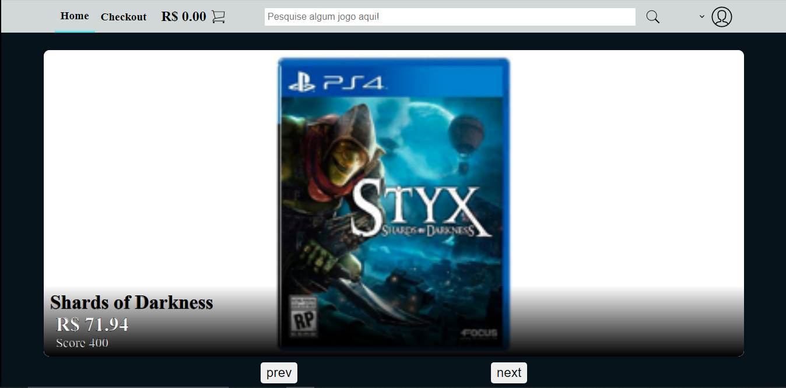
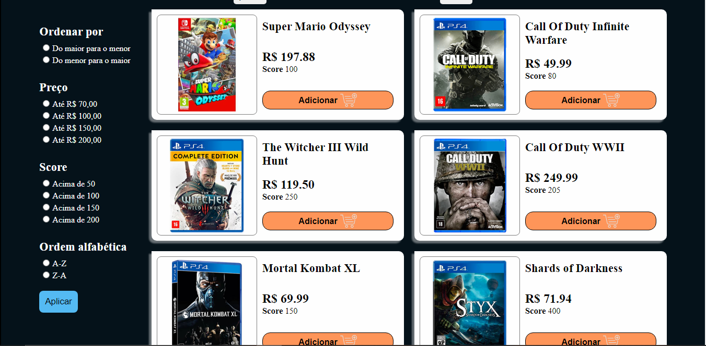
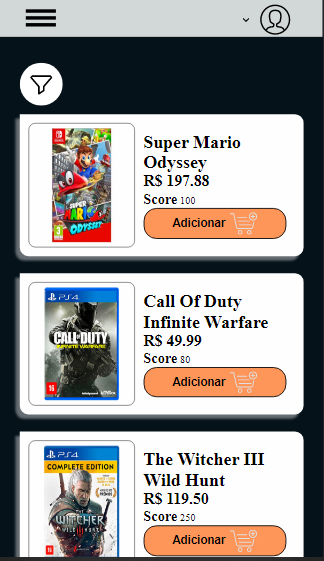
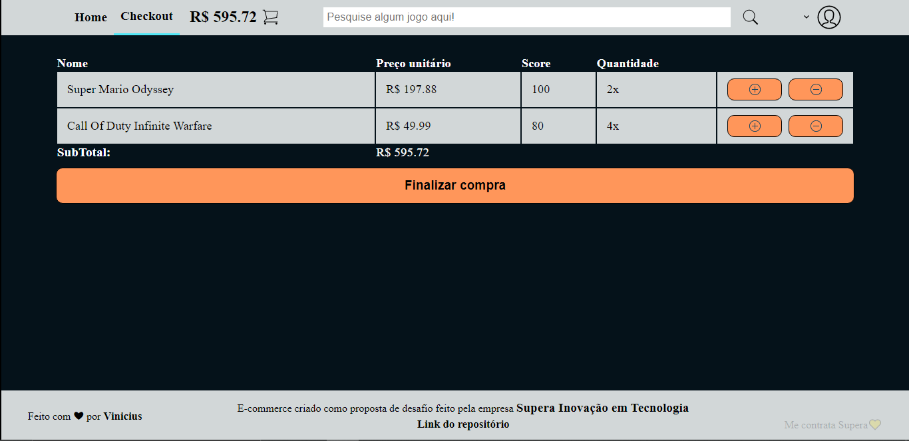
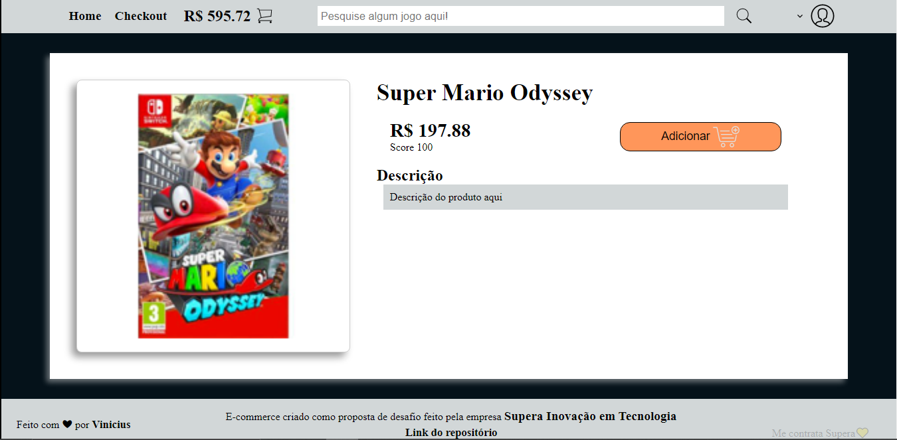
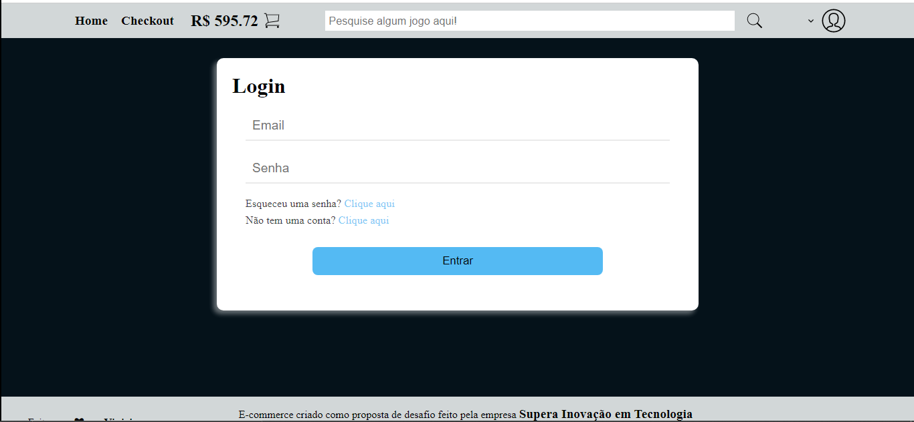
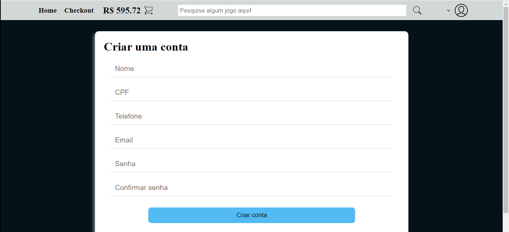

<h1 align="center">Desafio Supera Inovação em Tecnologia</h1>

## Oque se trata?

Trata-se de um e-commerce de games, que faz parte desafio tecnico proposto pela empresa Supera Inovação em Tecnologia, concorrendo a uma vaga de Desenvolvedor(a) Javascript

## Tecnologias e bibliotecas utilizadas

- ReactJS
- Styled-components
- Typescript
- React-toastly

  Na criação do projeto foi utilizado o boilerplate Create-React-App

## Requisitos minimos

- Ter o [nodejs](https://nodejs.org/en/){:target="\_blank"} instalado na sua maquina

## Como utilizar

- Faça o clone desse repositório
- Abra o projeto em algum editor de código de sua preferência
- No terminal do editor:
  - Execute o comando `npm install` para baixar todas as dependências do projeto
  - Logo após baixar as dependências, execute `npm start`
- O projeto irá abir em http://localhost/3000

## Screenshots

Home e carrousel

Listagem de produtos

Como ficaria no mobile

Página de checkout

Página de produto unitártio

Página de login

Página de criação de conta
